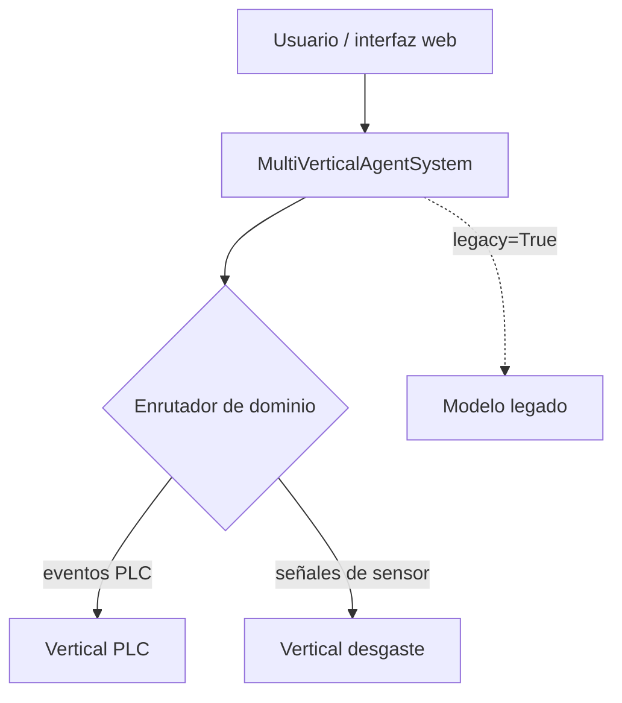
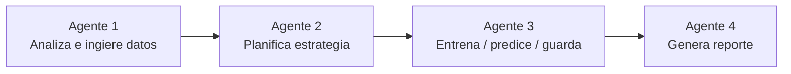
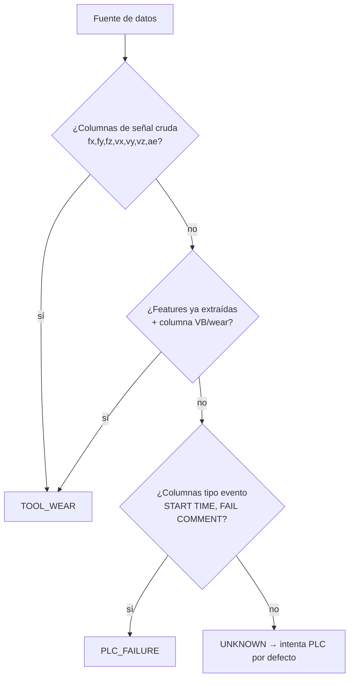

# Arquitectura del framework

Este documento explica **cómo está construido** el sistema y **por qué**
se tomaron las decisiones de diseño clave — no cómo instalarlo o correrlo
(eso está en `README.md`). Está pensado para alguien que va a **extender
o mantener** el código, no solo usarlo.

## Índice

1. [Visión general](#1-visión-general)
2. [El patrón de 4 agentes](#2-el-patrón-de-4-agentes)
3. [La interfaz `BasePredictor`](#3-la-interfaz-basepredictor)
4. [Las tres implementaciones de predictor](#4-las-tres-implementaciones-de-predictor)
5. [Enrutamiento de dominio](#5-enrutamiento-de-dominio)
6. [Contrato de API pública](#6-contrato-de-api-pública)
7. [Dos modos de operación](#7-dos-modos-de-operación)
8. [El modelo de confianza — por qué importa](#8-el-modelo-de-confianza--por-qué-importa)
9. [Decisiones de diseño y sus motivos](#9-decisiones-de-diseño-y-sus-motivos)
10. [Limitaciones conocidas — a propósito](#10-limitaciones-conocidas--a-propósito)
11. [Filosofía de pruebas](#11-filosofía-de-pruebas)
12. [Cómo agregar una vertical nueva](#12-cómo-agregar-una-vertical-nueva)

---

## 1. Visión general

El framework predice **fallas y desgaste en equipos industriales** a
partir de dos tipos de datos completamente distintos:

- **Fallas PLC**: eventos discretos de log (timestamp + texto), clasificación binaria.
- **Desgaste de herramienta**: señales de sensor de alta frecuencia (PHM 2010), regresión continua.

No existe un solo modelo que resuelva ambos problemas bien — los datos y
las tareas son demasiado distintos. En su lugar, el sistema es **un
framework con dos verticales especializadas**, más una tercera variante
de compatibilidad, todas detrás de un mismo punto de entrada.



---

## 2. El patrón de 4 agentes

Ambas verticales principales (PLC y desgaste) siguen **la misma
secuencia de 4 pasos**. Esto no siempre fue así — en versiones tempranas
la vertical de desgaste saltaba directo del Agente 1 al modelo, sin
pasar por planificación ni ejecución como agentes separados. Se unificó
deliberadamente para que ambas verticales sean igual de fáciles de
entender y extender.



| Paso | Responsabilidad | Vertical PLC | Vertical desgaste |
|---|---|---|---|
| **Agente 1** | Cargar datos crudos, detectar schema, evaluar calidad de datos cruda | `agents/agent1_analyzer.py` | `agents/agent1_tool_wear_loader.py` |
| **Agente 2** | Decidir ESTRATEGIA (qué modelo, qué hiperparámetros, qué split de evaluación) | `agents/agent2_planner.py` | `agents/agent2_tool_wear_planner.py` |
| **Agente 3** | Ejecutar el pipeline: entrenar o cargar, predecir, guardar | `agents/agent3_executor.py` | `agents/agent3_tool_wear_executor.py` |
| **Agente 4** | Generar el reporte HTML | `agents/agent4_reporter.py` — **compartido por ambas verticales** | (mismo archivo) |

**Regla de separación entre Agente 1 y Agente 2** (aprendida a partir de
un bug real): el Agente 1 solo reporta **observaciones de calidad de
datos crudos** ("solo 10 pasadas disponibles", "20% de valores
faltantes"). El Agente 2 es responsable de **decisiones de estrategia**
y sus consecuencias ("con un solo experimento, se usará split aleatorio
en vez de LOEO"). Antes de la separación, esta segunda advertencia vivía
en el Agente 1, lo cual mezclaba las dos responsabilidades. Ver
`tests/test_agent2_tool_wear_planner.py::test_advertencia_de_loeo_no_se_duplica_entre_agente1_y_agente2`.

---

## 3. La interfaz `BasePredictor`

Todo lo que hace posible que el Agente 3 y el Agente 4 sean genéricos
—sin necesidad de saber si están tratando con fallas PLC o desgaste de
herramienta— es esta interfaz (`core/base_predictor.py`):

```python
class BasePredictor(ABC):
    def fit(self, df: pd.DataFrame) -> dict: ...           # entrena, devuelve métricas
    def predict_all(self, df: pd.DataFrame) -> pd.DataFrame: ...  # predice
    def report_schema(self) -> ReportSchema: ...           # cómo renderizar el resultado
    def feature_importance(self) -> dict: ...              # opcional
    def save(self, path: str): ...                         # ya implementado en la base
    def load(cls, path: str) -> "BasePredictor": ...        # ya implementado en la base
```

`ReportSchema` es la pieza que permite que el **Agente 4 sea uno solo**
para ambas verticales: en vez de que el reportador sepa que PLC usa
columnas `PROB_FALLA`/`NIVEL_RIESGO` y desgaste usa
`VB_ESTIMADO`/`ESTADO`, cada predictor le dice al reportador cómo
llamarse a sí mismo:

```python
ReportSchema(
    domain_label="Predicción de fallas PLC",
    id_col="ADDRESS", id_label="Componente",
    primary_metric_col="PROB_FALLA", primary_metric_label="Probabilidad de falla",
    status_col="NIVEL_RIESGO",
    status_levels=[("🔴 ALTO", "#dc2626"), ("🟡 MEDIO", "#d97706"), ("🟢 BAJO", "#059669")],
    ...
)
```

**Si agregas una vertical nueva, esta es la única interfaz que tienes
que implementar** para que encaje en el resto del sistema. Ver
[sección 12](#12-cómo-agregar-una-vertical-nueva).

---

## 4. Las tres implementaciones de predictor

| Clase | Archivo | Dominio | Tarea | ¿Tiene Agente 2 propio? |
|---|---|---|---|---|
| `AdaptiveFailurePredictor` | `core/predictor.py` | Fallas PLC | Clasificación binaria | Sí — `agent2_planner.py` |
| `ToolWearPredictor` | `core/tool_wear_predictor.py` | Desgaste de herramienta | Regresión + RUL | Sí — `agent2_tool_wear_planner.py` |
| `LegacyPLCPredictor` | `core/legacy_plc_predictor.py` | Fallas PLC (repo externo) | Clasificación binaria | **No — a propósito** |

### `AdaptiveFailurePredictor` — el predictor principal de PLC

Arquitectura de 3 niveles según cuántos datos hay por componente:

- **LOCAL**: modelo Random Forest dedicado, si el componente tiene ≥ `min_eventos_modelo_local` eventos (default 30).
- **GLOBAL**: un único Random Forest entrenado con todos los componentes, usado como respaldo.
- **HEURÍSTICO**: promedio de probabilidad por categoría/panel, si el componente tiene menos de 3 eventos.

Usa `SafeEncoder` (vocabulario de categorías fijo, códigos `-1` para
categorías nunca vistas) y ajusta el PCA de embeddings **solo con datos
de entrenamiento** — las dos correcciones que `LegacyPLCPredictor`
deliberadamente no tiene.

### `ToolWearPredictor` — desgaste de herramienta (PHM 2010)

Ensamble Random Forest + XGBoost (si xgboost está disponible; si no,
degrada a solo RF sin fallar). Con ≥ 2 experimentos, usa split
Leave-One-Experiment-Out (LOEO); con uno solo, cae a split aleatorio con
advertencia. Puede cargarse desde artefactos entrenados en Kaggle
(`ToolWearPredictor.from_kaggle_artifacts()`), sin necesitar reentrenar.

### `LegacyPLCPredictor` — compatibilidad con el repositorio original

Replica **exactamente** el comportamiento de
`luisroberto-maker/PLC-failure-prediction-pipeline`, MAPEO_FALLAS
idéntico incluido (verificado programáticamente, 474 entradas iguales
byte a byte). Existe para poder usar modelos `.pkl` ya entrenados con
ese repositorio, sin reentrenar.

**No tiene Agente 2 porque no hay ninguna decisión de estrategia que
tomar** — el repositorio original no tiene script de entrenamiento
propio, solo consume un modelo ya fijo. Forzar un Agente 2 aquí sería un
paso vacío. Esto está documentado como excepción deliberada, no como una
inconsistencia sin resolver — ver el comentario en
`orchestrator.py::_predict_only_plc_legacy`.

---

## 5. Enrutamiento de dominio

`agents/domain_router.py` decide qué vertical usar **inspeccionando la
forma de los datos**, no pidiéndole al usuario que lo especifique:



Se puede forzar explícitamente con `force_domain="tool_wear"` en
`run()`, o `domain="plc_failure"` en `predict_only()`, sin depender de
la heurística.

---

## 6. Contrato de API pública

**Esto es lo único contra lo que deberías programar** si estás
construyendo algo encima de este framework (como una interfaz web). Todo
lo demás es implementación interna que puede cambiar entre versiones sin
aviso.

```python
from orchestrator import MultiVerticalAgentSystem

system = MultiVerticalAgentSystem(config=AgentConfig(...))  # config es opcional

# Entrenar desde cero
system.run(source, client_id: str, column_map: dict = None,
          force_domain: str = None, verbose: bool = True) -> str  # ruta del reporte HTML

# Inferencia con modelo ya entrenado, sin reentrenar
system.predict_only(source, client_id: str, domain: str = None,
                    model_path: str = None, artifacts_dir: str = None,
                    legacy: bool = False, verbose: bool = True) -> str

# Actualización incremental (solo vertical PLC por ahora)
system.update(source, client_id: str, column_map: dict = None) -> str

# Resultado de la última operación
system.get_ranking() -> pd.DataFrame | None
system.get_metrics() -> dict
system.last_domain -> Domain
```

**No dependas de:**
- Los nombres de columna exactos del DataFrame que devuelve `get_ranking()` — difieren entre verticales (`PROB_FALLA` vs `VB_ESTIMADO`). Si necesitas un formato uniforme, usa `predictor.report_schema()` para mapear genéricamente.
- Las clases internas (`AdaptiveFailurePredictor`, `ToolWearPredictor`, agentes individuales) — son detalles de implementación. Solo `BasePredictor` (la interfaz) es estable.
- El formato del HTML de reporte — está pensado para verse en navegador, no para parsearse programáticamente. Si necesitas los datos, usa `get_ranking()`.

---

## 7. Dos modos de operación

| | `run()` | `predict_only()` |
|---|---|---|
| ¿Entrena? | Sí, desde cero | No — carga un modelo ya entrenado |
| ¿Requiere datos con target/etiquetas? | Sí (TARGET/VB conocido) | No — solo features |
| Velocidad | Minutos (entrena) | Segundos (solo inferencia) |
| Uso típico | Primera vez, o reentrenamiento periódico | Uso diario/producción, batch de nuevos datos |

Los modelos entrenados con `run()` se guardan automáticamente en
`{model_dir}/predictor_{client_id}.pkl` (o `tool_wear_predictor_...pkl`)
— `predict_only()` los busca ahí por defecto, o en la ruta que se le
indique explícitamente.

---

## 8. El modelo de confianza — por qué importa

Cada predicción viene con un nivel de confianza (`ALTO`/`MEDIO`/`BAJO`)
que **no es un adorno** — comunica cuánta evidencia real respalda ese
número. En `AdaptiveFailurePredictor`:

```python
def _nivel_confianza(self, incertidumbre, n_eventos):
    if n_eventos < 10 or incertidumbre > umbral_incertidumbre:
        return "BAJO"
    elif incertidumbre > 0.15:
        return "MEDIO"
    return "ALTO"
```

Un componente con **1-3 eventos históricos** cae automáticamente al modo
`HEURÍSTICO` (promedio por categoría/panel) con confianza `BAJO`, sin
importar qué probabilidad puntual arroje. Esto es intencional: **es
mejor que el sistema admita que no sabe, a que invente certeza que no
tiene**.

Al interpretar un reporte, **siempre cruza `NIVEL_RIESGO` con
`NIVEL_CONFIANZA` y `N_EVENTOS`** — un "ALTO riesgo" con confianza baja y
1 evento es una hipótesis débil que merece más datos antes de actuar, no
una alarma urgente. `LegacyPLCPredictor` no tiene este mecanismo — es
una de las razones documentadas por las que puede reportar probabilidades
altas con la misma aparente seguridad, sin importar cuántos datos
respaldan esa predicción específica.

---

## 9. Decisiones de diseño y sus motivos

| Decisión | Por qué |
|---|---|
| `BasePredictor` como interfaz mínima (no una clase base con lógica compartida) | Los tres predictores comparten muy poco código real (el preprocesamiento de PLC y de señales de sensor no tienen nada en común) — forzar herencia de implementación habría creado acoplamiento artificial. |
| `AgentConfig` con Pydantic, no `@dataclass` | Un valor inválido (`umbral_critico=-5`) falla al construir el objeto, con mensaje claro — no minutos después, a mitad del entrenamiento. Ver `tests/test_config_validation.py`. |
| `logging` en vez de `print()` | Permite controlar verbosidad sin editar código (`--log-level`, `PLC_AGENT_LOG_LEVEL`) — necesario en cuanto este framework se use dentro de otra aplicación, como una interfaz web. |
| `pyproject.toml` en vez de solo `requirements.txt` | Hace el proyecto instalable (`pip install -e .`), con comando de consola propio y metadata declarada en un solo lugar. |
| Límites superiores en las versiones de dependencias (`pandas>=2.0,<4.0`) | Una actualización mayor no probada (pandas 3.0) introdujo 3 incompatibilidades reales durante el desarrollo — ver `core/predictor.py` y los comentarios de compatibilidad ahí. |
| `LegacyPLCPredictor` como wrapper separado, no una corrección del repositorio original | El objetivo era poder usar modelos `.pkl` ya entrenados con ese repositorio exactamente como se entrenaron — "arreglar" sus bugs conocidos (LabelEncoder, PCA reajustados) habría hecho que esos modelos ya entrenados dejaran de ser compatibles. |

---

## 10. Limitaciones

Estos puntos son comportamientos documentados y
deliberados. A continuación se describe por qué existen así:

- **`LegacyPLCPredictor` reajusta el `LabelEncoder` y el PCA en cada
  llamada a `predict_all()`.** Es el comportamiento exacto del
  repositorio que envuelve. Si esto afecta en producción, la solución
  es migrar a `AdaptiveFailurePredictor`, no parchear el legado.
- **La vertical de desgaste no tiene `update()` incremental** — solo la
  vertical PLC lo tiene por ahora.
- **`min_eventos_entrenamiento` e `idioma_reporte` en `AgentConfig`
  están definidos pero no se usan en ningún otro lugar del código** —
  son campos de configuración "muertos" que quedaron de una iteración
  anterior. No es un bug activo, pero vale la pena limpiarlos o
  implementarlos antes de que alguien asuma que ya hacen algo.
- **El reporte HTML no está pensado para parsearse** — es para
  visualización humana. Para integrarlo con otra aplicación (como una
  interfaz web), usa `get_ranking()` / `get_metrics()`, no el HTML.

---

## 11. Filosofía de pruebas

Cada bug real encontrado durante el desarrollo tiene **una prueba de
regresión dedicada**, con un comentario explicando qué se rompía y por
qué — no pruebas genéricas de "que no truene". Ver por ejemplo
`tests/test_predictor_tool_wear.py::TestComputeRUL`, que documenta y
previene el bug donde la vida útil restante calculada podía dispararse a
valores como 76,325,000 pasadas por dividir entre una tasa de desgaste
casi cero.

**Si corriges un bug, agrega la prueba de regresión en el mismo cambio**
— no después, no "cuando haya tiempo". Es la única forma en que este
patrón sigue siendo útil.

Las pruebas usan datos sintéticos y un modelo de embeddings simulado
(`tests/conftest.py::FakeEmbeddingModel`) para no depender de red ni de
datos reales de cliente.

---

## 12. Cómo agregar una vertical nueva

Si en el futuro hay un tercer tipo de dato que predecir, el patrón a
seguir es:

1. **Implementa `BasePredictor`** en un archivo nuevo bajo `core/` —
   `fit()`, `predict_all()`, `report_schema()`. Este es el contrato
   mínimo real.
2. **Crea un Agente 1** (`agents/agent1_<nombre>_loader.py`) que cargue
   y valide el nuevo tipo de dato, devolviendo `(df, InferredSchema)`.
3. **Crea un Agente 2** (`agents/agent2_<nombre>_planner.py`) que decida
   la estrategia de entrenamiento — aunque sea simple, dale su propio
   agente en vez de mezclar la decisión dentro del ejecutor.
4. **Crea un Agente 3** (`agents/agent3_<nombre>_executor.py`) con
   `execute()` y `load_and_predict()`, siguiendo la forma de
   `ToolWearExecutorAgent`.
5. **Extiende `agents/domain_router.py`** con la heurística de detección
   para el nuevo tipo de dato.
6. **Extiende `MultiVerticalAgentSystem`** en `orchestrator.py` para
   despachar al nuevo Agente 1/2/3 según el dominio detectado.
7. **No toques `agents/agent4_reporter.py`** — si tu `report_schema()`
   está bien definido, el reporte genérico ya debería funcionar sin
   cambios.
8. **Agrega fixtures y pruebas** en `tests/`, siguiendo el patrón de
   `tests/test_agent2_tool_wear_planner.py` y
   `tests/test_predictor_tool_wear.py`.
